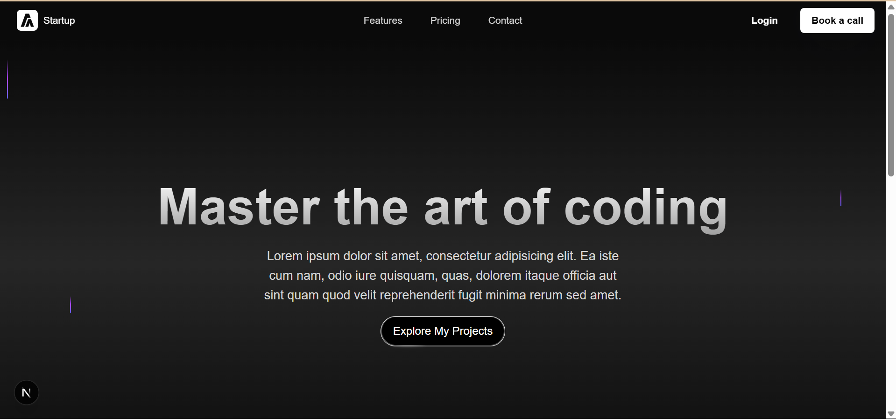
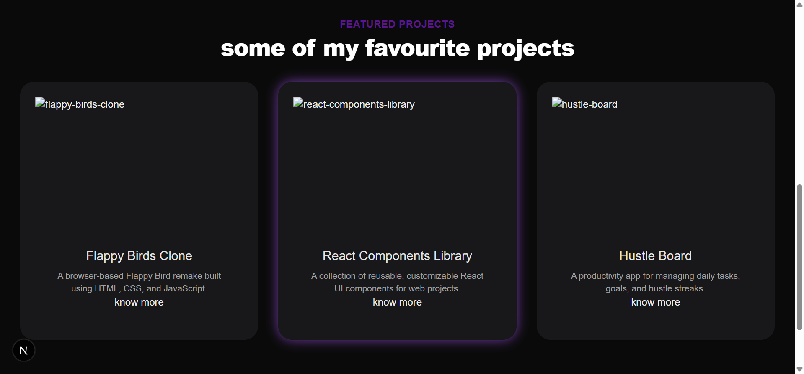

# 🧑‍💻 Aryan Kapoor's Developer Portfolio

Welcome to my personal developer portfolio, built with **Next.js**, **TypeScript**, and **Tailwind CSS**. This project is a modern, responsive showcase of my skills, projects, and experiences as a developer.

---

## 🚀 Tech Stack

- **Framework**: [Next.js](https://nextjs.org/)
- **Language**: TypeScript
- **Styling**: Tailwind CSS
- **Font Optimization**: [next/font](https://nextjs.org/docs/pages/api-reference/components/font)
- **Package Manager**: npm

---

## 🗂️ Project Structure

portfolio/
├── public/ # Static assets
├── src/
│ ├── app/ # App directory for routes/pages
│ │ └── page.tsx # Main portfolio page
│ └── components/ # Reusable UI components
├── .gitignore
├── README.md
├── package.json
├── tsconfig.json
├── next.config.ts
├── postcss.config.mjs
├── eslint.config.mjs
└── tailwind.config.js

---

## 📦 Getting Started

To set up the project locally:

```bash
git clone https://github.com/meowkapoor/portfolio.git
cd portfolio
npm install
npm run dev
Then visit: http://localhost:3000
```

---

## ✨ Features

- Fully responsive layout  
- Fast loading and SEO-optimized  
- Built with modern frontend stack and animations
- Clean, modular codebase for easy expansion  

---

## 🔮 Upcoming Improvements

- Add projects and detailed experience sections  
- Integrate contact form with email support  
- Add animations and transitions  

---

## 📸 Screenshots

|  |  |

---

## 📬 Contact

- [LinkedIn](https://www.linkedin.com/in/aryan-kapoor/)
- [GitHub](https://github.com/meowkapoor)
- [Twitter](https://twitter.com/meowkapoor)
